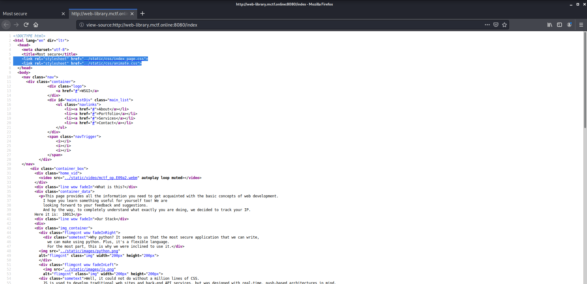
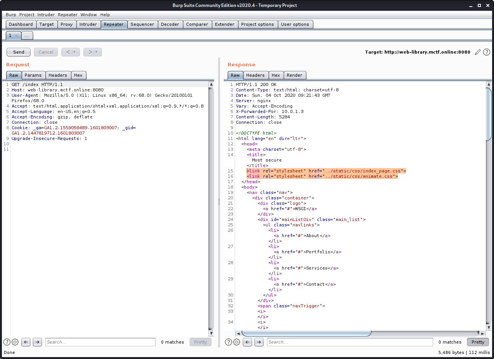
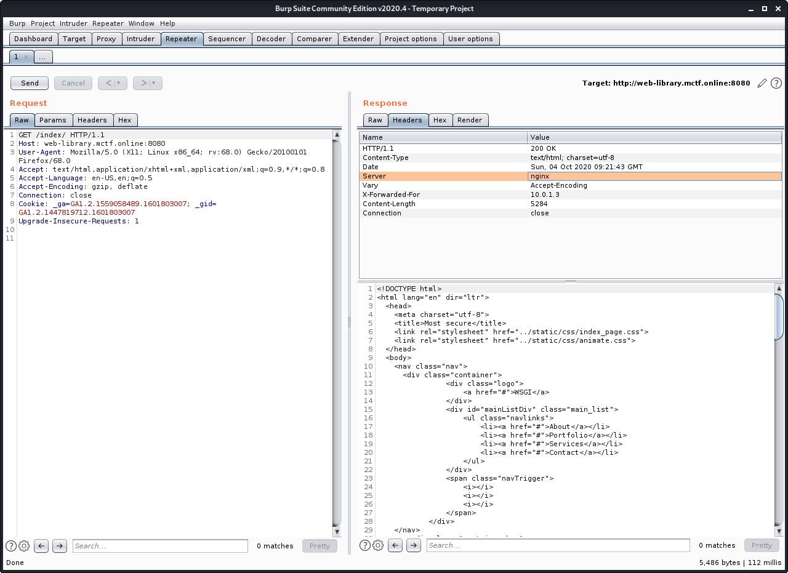
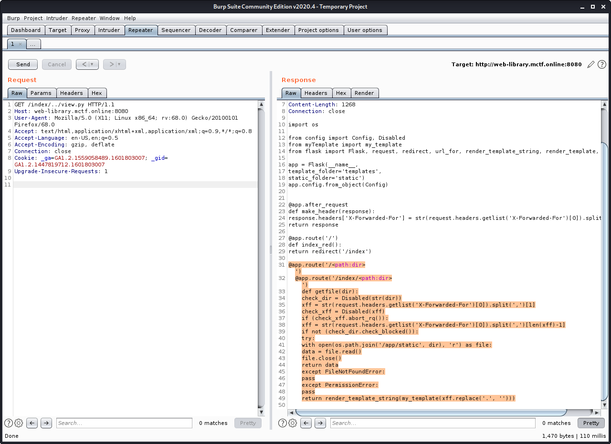

# Web-wiki. The beginning

## Первые шаги

Как только появляется возможность зайти в таск, можно заметить несколько вещей:
- На основной странице в Template попадает заголовок XFF, который генерится после отправки запроса.
- В качестве сервера выступает Nginx. На основной странице информация о том, что бэк написан на Python.

## Как сплойтится XFF? 
Наверное, без исходного кода достаточно сложно понять, что именно происходит при попытке подмены XFF. Многие сталкивались с тем, что при отправке своих Хедеров сайт отображал все тот же IP. А что, если я скажу, что есть возможность получить доступ к исходному коду?

### В ход вступает Path traversal... 

## Что на бэке? 
При правильной эксплуатации path traversal (чтение wsgi.py, точки входа для Nginx) можно наткнуться и на остальные, необходимые файлы для дальнейшего решения. Как пример - veiw.py

### Разбираемся с кодом
Очевидно, что на бэке имеется роутинг, который ловит любой url path и открывает файл по данному пути, начиная с папки 'static'. Также, можно заметить, что после каждого запроса XFF задается заново и отбрасывает точки, что наталкивает нас на дальнейшие действия. 

` if (check_xff.abort_rq()):
        xff = str(request.headers.getlist('X-Forwarded-For')[0]).split(',')[len(xff)-1]
`
Данная строка говорит о том, что берется определенный элемент из XFF(если рассмотреть подробнее, то в request.headers.getlist всегда хранится list с len() == 2)

## Эксплойт! 
Гуглим: python ssti, первой же ссылкой получаем всю необходимую информаицию:
> https://istroev.me/Server-side-template-injection-python/

Пример эксплойта представлен ниже:

`123, {{request['application']['__globals__']['__builtins__']['__import__']('os')['popen']('cat *')['read']()}}`
### Замечаем, что флаг хранится в env. Дальше есть 2 вектора, покажу один из них:
`123, {{request['application']['__globals__']['__builtins__']['__import__']('os')['popen']('env')['read']()}}`

